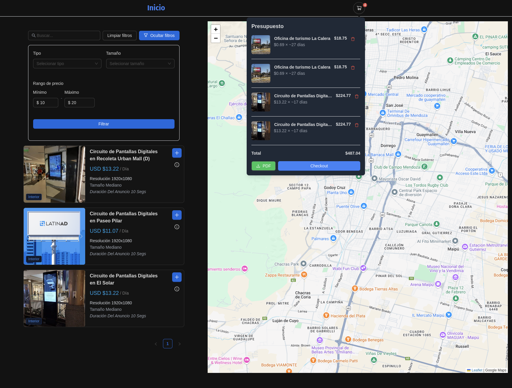
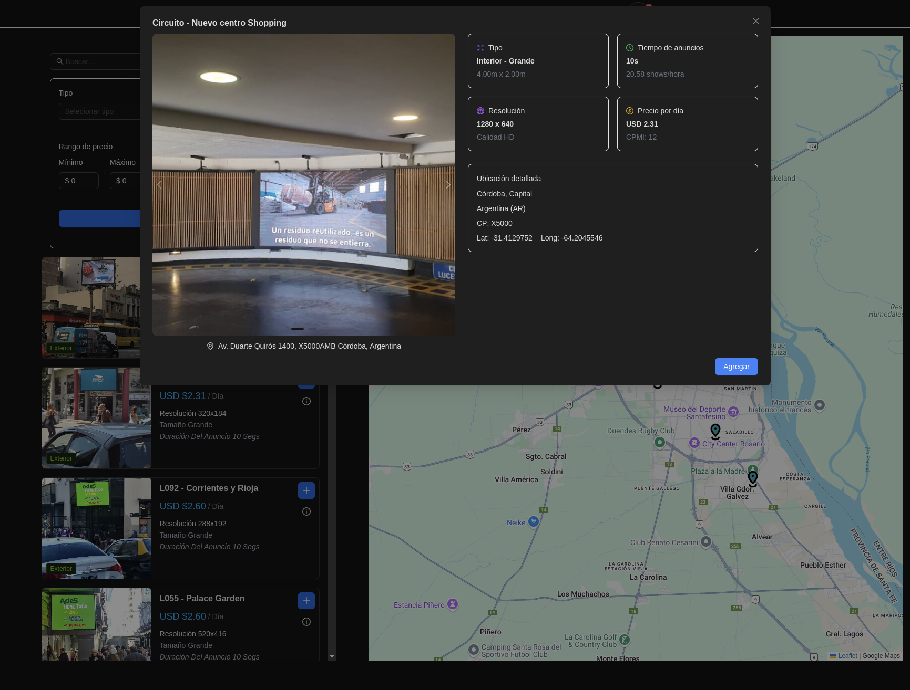
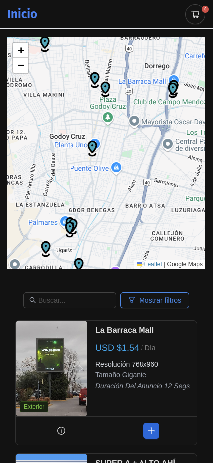
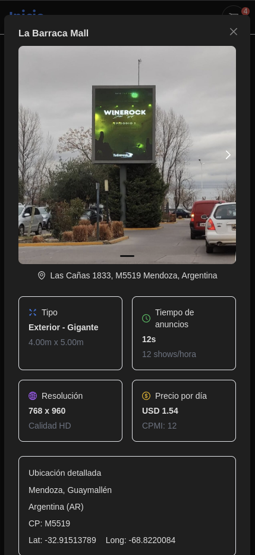
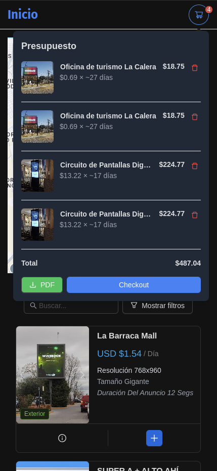
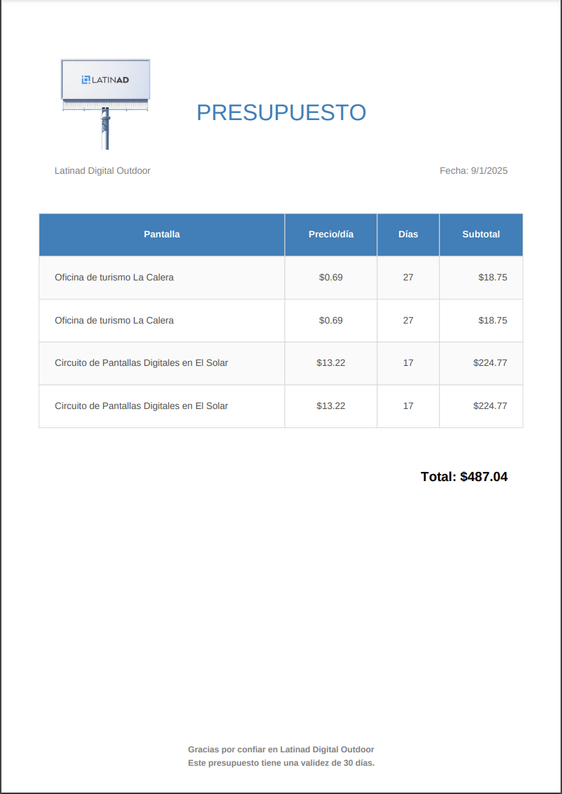

<div align="center">

# LatinAd Challenge



### El equipo de LatinAd solicita una web que permita a los usuarios simular el costo de lanzar una campaña en pantallas digitales.

## [Live](https://screens-teal.vercel.app/)

</div>

## Funcionalidades

Los usuarios podrán:

1. Ingresar fecha de inicio, fecha de fin y lugar o zona donde desean lanzar la campaña.
2. Ver un listado de las pantallas disponibles en esa fecha y un mapa que muestre dónde está ubicada cada pantalla.
3. Ver los detalles específicos de una pantalla en una vista o ventana modal específica para ello que se abra al hacer click en una pantalla específica (ya sea en el listado y/o en el mapa).
4. Filtrar las pantallas según nombre, tipo, rango de precios y/o tamaño.
5. Agregar pantallas a un carrito.
6. Ver el carrito y quitar pantallas que se habían agregado.
7. Descargar un PDF de un presupuesto con todas las pantallas agregadas al carrito.

El carrito y el presupuesto PDF deben mostrar el costo total de la campaña. La API devuelve el costo por día de cada pantalla, se debe multiplicar ese costo por la cantidad de días. Todos los precios están expresados en USD.

## Consideraciones

- La solución debe tener por lo menos dos vistas distintas:
  - Vista uno: buscador.
  - Vista dos: listado, mapa y carrito.
- Para pasar del punto 1 al punto 2 se necesita hacer uso de una API de geocoding (convertir el nombre de una ciudad en coordenadas). Se puede usar Nominatim API, la API de Geocoding de Google o alguna similar para obtener las coordenadas centrales del mapa y luego los vértices del área visible del mapa.
- El carrito debe implementarse del lado del cliente.
- Nos gustaría poder navegar por las vistas sin que se pierda el estado del carrito.
- La solución debe ser desarrollada utilizando React.js, Redux y Sagas. Se puede utilizar cualquier librería de componentes o estilos, pero recomendamos Ant Design.

## Tecnologías Utilizadas

- **React.js**: Biblioteca principal para la construcción de la interfaz de usuario.
- **Redux**: Para la gestión del estado global de la aplicación.
- **Redux-Saga**: Para manejar los efectos secundarios (side effects) en la aplicación.
- **Ant Design**: Librería de componentes UI recomendada.
- **Leaflet**: Para la visualización de mapas.
- **Nominatim API**: Para la geocodificación de ubicaciones.

## Instalación y Ejecución

1. Clonar el repositorio:

   ```bash
   git clone https://github.com/TanisJam/screens.git
   cd latinad-challenge
   ```

2. Crear un archivo `.env` en la raíz del proyecto con las siguientes variables:

   ```env
   VITE_API_BASE_URL=https://api.dev.publinet.io
   ```

3. Instalar `pnpm` si no lo tienes:

   ```bash
   npm install -g pnpm
   ```

4. Instalar las dependencias:

   ```bash
   pnpm install
   ```

5. Ejecutar la aplicación en modo desarrollo:

   ```bash
   pnpm dev
   ```

   La aplicación estará disponible en [http://localhost:5173/](http://localhost:5173/).

6. Construir la aplicación para producción:

   ```bash
   pnpm build
   ```

7. Previsualizar la aplicación construida:

   ```bash
   pnpm preview
   ```

   La previsualización estará disponible en [http://localhost:4173/](http://localhost:4173/).

   ```

   ```

## Buenas Prácticas

- **Desarrollo**: Se han seguido buenas prácticas de desarrollo, incluyendo el uso de hooks personalizados, componentes reutilizables y una estructura de carpetas organizada.
- **GIT**: Se han seguido buenas prácticas en el uso de GIT, con commits claros y descriptivos.
- **Usabilidad y Estética (UX/UI)**: Se ha prestado atención a la usabilidad priorizando una experiencia de usuario agradable aunque dista de ser un diseño wow.
- **Performance**: Se ha optimizado la performance y el buen uso de recursos.
- **Responsiveness**: La aplicación es responsive y se adapta tanto a desktop como a mobile.

## Características y Requerimientos

- [x] Ingreso de fecha de inicio, fecha de fin y lugar o zona.
- [x] Listado de pantallas disponibles y mapa con ubicación.
- [x] Vista o ventana modal con detalles específicos de una pantalla.
- [x] Filtros de pantallas por nombre, tipo, rango de precios y tamaño.
- [x] Agregar pantallas a un carrito.
- [x] Ver y quitar pantallas del carrito.
- [x] Navegación entre vistas sin perder el estado del carrito.
- [x] Implementación del carrito del lado del cliente.
- [x] Descarga de PDF con presupuesto (opcional).
- [x] Uso de API de geocoding para obtener coordenadas.
- [x] Desarrollo utilizando React.js, Redux y Sagas.
- [x] Uso de Ant Design para componentes UI.
- [x] Uso de Leaflet para visualización de mapas.
- [x] Buenas prácticas de desarrollo y uso de GIT.
- [x] Optimización de performance y buen uso de recursos.
- [x] Responsiveness en desktop y mobile.

## Consideraciones futuras

- [ ] Añadir tests unitarios.
- [ ] Refactorizar código para separación de responsabilidades.
- [ ] Hacer que el formulario de filtrado esté sincronizado con el estado de redux.
- [ ] Añadir feedback en la pantalla de detalles para informar si ya está agregada esa pantalla al carrito.
- [ ] Añadir más detalles de ubicación al presupuesto final.
- [ ] Implementar navegación desde la vista de detalles al mapa.
- [ ] Mejorar el filtro de mínimo y máximo de presupuesto.
- [ ] Mejorar la interfaz.

## Capturas de Pantalla

<div align="center">




<br>

</div>
